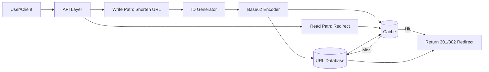
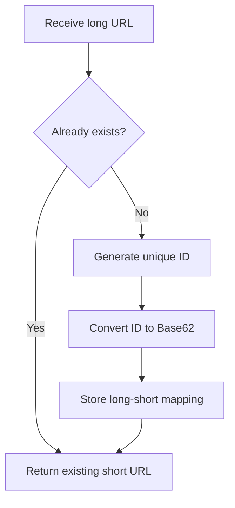
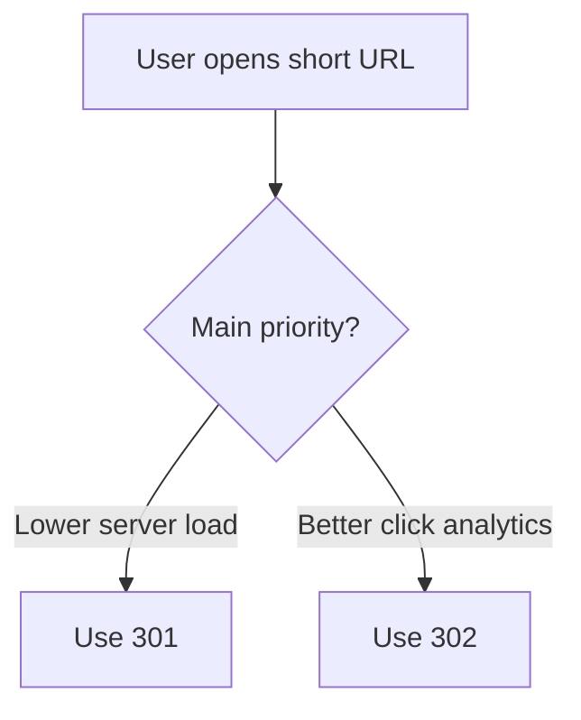

# Critical Analysis Report: Design a URL Shortener 

## 1. Problem Statement Analysis

Chapter 8 discusses the design of a URL shortener similar to TinyURL. The system converts a long URL into a short alias and maps it back to the original destination when users open it. The chapter sets clear quantitative limits: the system should handle 100 million new URLs per day, support a read load about ten times higher than the write load, and remain reliable over ten years. Under these assumptions, the projected scale reaches 365 billion records and about 365 TB of storage. The design space is narrowed further by limiting short codes to alphanumeric characters and by excluding delete and update operations.

For clarity, the core constraints can be summarized as follows:

- 100 million new URLs per day
- Read-to-write ratio of 10:1
- 10-year design horizon
- 365 billion projected records
- Approximately 365 TB storage requirement
- Alphanumeric short-code space (`0-9`, `a-z`, `A-Z`)
- No delete/update operations in scope

From an academic perspective, this framing is effective because it balances conceptual clarity with measurable system demands. It is realistic enough to justify architecture-level trade-offs, but still manageable for an interview setting.

## 2. Analysis of the Author's Solution

### 2.1 API Design

The proposed API surface is concise and aligned with REST-style communication principles: one endpoint for shortening (`POST /api/v1/data/shorten`) and one endpoint for redirection (`GET /api/v1/shortUrl`). This clean separation between creation and resolution is logically coherent and supports maintainable service boundaries.

### 2.2 Redirect Design (301 vs. 302)

The discussion of HTTP 301 and 302 redirects is one of the strongest parts of the chapter. The author explains clearly that a 301 response improves efficiency through client-side caching, while a 302 response keeps repeated requests visible to the service and is therefore better for analytics-oriented products. A key strength is that this is treated as a product-driven architectural decision, not only a technical preference.

### 2.3 Hashing and Short URL Generation

Two generation strategies are evaluated:

- a hash-first method with collision handling
- Base62 conversion of unique numeric identifiers

The final deep-dive flow adopts Base62 conversion, which removes practical collision risk when identifier uniqueness is guaranteed. This is a sensible direction for scale, since deterministic encoding is operationally easier to manage than repeated collision-resolution loops.

### 2.4 Data and Flow Evolution

The chapter moves from an introductory hash-table mental model to a more realistic architecture based on persistent storage and cache-backed read optimization. This progression is methodologically sound: it begins with conceptual clarity and then introduces practical components for read-heavy systems.

## 3. Diagram-Based Understanding

The following diagrams summarize the architecture and decision logic discussed in the chapter and reviewed in this report.

### 3.1 High-level Architecture

This diagram shows the overall architecture: write requests generate and store short URLs, while read requests check cache first and fall back to the database before redirecting.

### 3.2 URL Shortening Flow

This flow explains how a short URL is created, including duplicate checking, ID generation, Base62 conversion, and final storage of the URL mapping.

### 3.3 Redirect Decision Logic

This decision diagram highlights that redirect choice depends on business goals: 301 favors performance and caching, while 302 favors analytics visibility.

## 4. Critical Review 

The chapter is strong in structure, clarity, and communication. It moves in a disciplined way from requirement clarification to architecture and then implementation detail, which works well for system design learning. The throughput and capacity calculations are straightforward and defensible for first-order planning. The redirect analysis also shows clear awareness of the trade-off between platform efficiency and measurement capability.

The main strengths are:

- clear progression from scope to design to deep dive
- practical traffic and storage estimation
- strong treatment of 301 vs. 302 as a product decision
- sensible final choice of Base62 in the detailed flow

At the same time, the solution remains closer to interview adequacy than production completeness. The hash-collision path is introduced, but not fully formalized in terms of algorithmic limits or behavior under adverse input. The distributed ID generator is acknowledged as important, yet details on availability, failure recovery, and latency budget remain limited. Database sharding and replication also appear mainly as wrap-up points rather than core design pillars, despite the projected long-term volume. Cache behavior is introduced appropriately, but not examined in depth for eviction policy, consistency expectations, and degradation modes. Security coverage focuses mostly on rate limiting, while broader abuse prevention, such as malicious URL screening and short-code enumeration mitigation, is left implicit.

The key limitations are:

- incomplete formalization of hash-collision handling
- limited detail on distributed ID generator reliability
- late treatment of sharding/replication despite scale
- insufficient discussion of cache policy and failure behavior
- minimal security depth beyond rate limiting

## 5. My Understanding, Confusions, and Further Exploration

My understanding is strongest around the central architectural logic: read-heavy systems need strong cache leverage, deterministic Base62 encoding simplifies short-code generation when unique IDs are dependable, and redirect semantics should be selected according to product objectives rather than convention alone. I also find the chapter effective in showing how a simple conceptual model can evolve into a scalable service pattern.

My remaining confusions are concentrated in distributed-systems details that are only lightly treated. In particular, I would like a clearer model of fault-tolerant ID generation, a concrete strategy for duplicate-long-URL checks in a sharded environment, and more explicit placement of Bloom filters within the end-to-end control flow. I also consider short-code predictability an open concern when sequential identifiers are used without additional obfuscation.

Specifically, I remain uncertain about:

- the exact failure model and recovery strategy of the ID generator
- practical duplicate-detection performance under heavy sharding
- where Bloom filters should be placed for best effect
- how sequential-code predictability is mitigated

For deeper study, the most valuable next topics are:

- Snowflake-style ID generation
- abuse-resistant URL safety pipelines
- privacy-aware analytics design
- lifecycle-based storage tiering
- multi-region failover for low-latency redirection

## 6. Brief Summary of Critical Analysis

In summary, Chapter 8 offers a solid, well-structured, and interview-effective solution to URL shortener design. Its main strengths are clear requirement framing, practical API and redirect choices, and a reasonable progression toward scalable components. However, to meet production-grade expectations, the design needs deeper treatment of ID generation resilience, data partitioning strategy, cache policy definition, and security controls. The chapter therefore serves as a strong foundation, but not a complete operational blueprint.

## References

Chapter 8: Design a URL shortener. (2026). In *SystemDesignInterview* [Course handout].

REST API Tutorial. (n.d.). *A RESTful tutorial*. Retrieved March 23, 2026, from https://www.restapitutorial.com/index.html

Wikipedia contributors. (n.d.). Bloom filter. In *Wikipedia*. Retrieved March 23, 2026, from https://en.wikipedia.org/wiki/Bloom_filter
