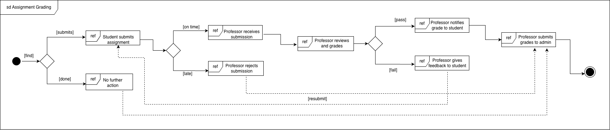
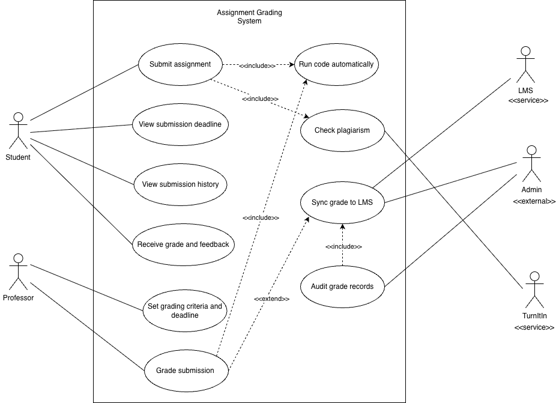
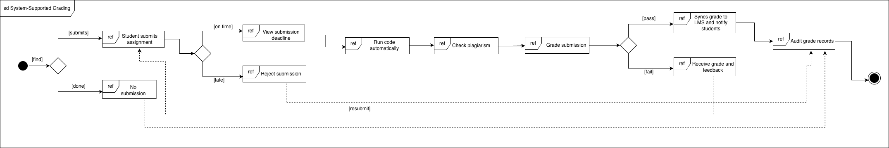

# UML Modelling for Automated Assignment Grading System

## Problem Statement

A university with 300+ students per year currently has no plagiarism checker or automated marking software. Professors manually clone student GitHub repositories, run code locally, and grade it in VSCode. This assignment models a proposed Automated Assignment Grading System using UML diagrams.

---

## System Requirements Summary

| SL.No | Requirement |
|---|---|
| 1 | Students must be able to upload source code which will be run and graded |
| 2 | Grades and runs must be persistent and auditable |
| 3 | Plagiarism detection via peer comparison and TurnItIn web service |
| 4 | Integration with the University's mainframe-based LMS |
| 5 | Professor sets due date and time; late submissions are rejected |
| 6 | Students can submit multiple attempts to improve their grade |
| 7 | Professors define grading criteria including metrics and/or tests |

---

## Actors

| Actor | Type | Role |
|---|---|---|
| Student | Primary | Submits assignments, views grades and feedback |
| Professor | Primary | Sets criteria, reviews submissions, assigns grades |
| Admin / Regulatory Body | External | Audits grade records annually |
| LMS | Service | Receives synced grades from the system |
| TurnItIn | Service | External plagiarism detection web service |

---

## Q1. Interaction Overview Diagram (Actor-to-Actor)

**Purpose:** Shows how the human actors interact with each other to achieve the business outcome of grading an assignment, *without* any system involvement. This is the as-is or conceptual business flow.

**Actors involved:** Student, Professor, Admin/Regulatory Body

**Flow summary:**
1. Student decides to submit an assignment
2. Professor checks whether the submission is within the due date
3. If late, Professor rejects it; if on time, Professor receives it
4. Professor manually reviews and grades the work
5. If the student passes, Professor notifies the grade and submits records to Admin
6. If the student fails, Professor gives feedback and the student resubmits
7. Admin records and audits the final grades

**Key decisions modelled:**
- `[submit]` / `[done]` — whether the student submits at all
- `[on time]` / `[late]` — due date enforcement by Professor
- `[pass]` / `[fail]` — grade outcome determining next action
- `[resubmit]` — loop back for improvement (multiple attempts allowed)

---

## Q2. Functional Use Case Diagram (UCD)

**Purpose:** Identifies all system functions needed to support the actor interactions established in Q1. Derived directly from the Q1 IoD — every actor-to-actor exchange becomes one or more system use cases.

**System boundary:** Assignment Grading System

**Use Cases:**

| Use Case | Primary Actor | Description |
|---|---|---|
| Submit assignment | Student | Upload source code to the system |
| View submission deadline | Student | Check the due date set by Professor |
| View submission history | Student | See all past attempts and scores |
| Receive grade and feedback | Student | View grade and professor comments |
| Set grading criteria and deadline | Professor | Configure tests, metrics, and due date |
| Grade submission | Professor | Review results and assign a final grade |
| Run code automatically | System (triggered) | Execute submitted code against criteria |
| Check plagiarism | System + TurnItIn | Compare with peers and submit to TurnItIn |
| Sync grades to LMS | LMS | Push final grades to university LMS |
| Audit grade records | Admin | Access persistent grade history for auditing |

**Relationships:**
- `«include»` Submit assignment → Run code automatically *(always runs on submit)*
- `«include»` Submit assignment → Check plagiarism *(always checks on submit)*
- `«include»` Grade submission → Run code automatically *(professor-triggered re-run)*
- `«extend»` Grade submission → Sync grades to LMS *(only on final pass grade)*
- `«include»` Audit grade records → Sync grades to LMS *(audit requires synced records)*

---

## Q3. Interaction Overview Diagram (System-Supported)

**Purpose:** Combines Q1 (actor flow) and Q2 (use cases) to show how actors now interact *through the system* to achieve the same business outcome. Every `ref` frame references a use case from Q2. The system mediates all interactions.

**Key differences from Q1 IOD:**
- "Professor manually reviews" → system **runs code automatically** and **checks plagiarism** first
- "Professor checks due date" → system **enforces deadline** automatically via View submission deadline
- "Professor notifies grade" → system **syncs grades to LMS** and notifies student
- "Admin collects grades" → system provides **Audit grade records** use case with full persistent history
- Resubmit loop now goes back to the **Submit assignment** use case (system-mediated), not directly to the Professor

**Flow summary:**
1. Student submits via the system `[submit]` / `[done]`
2. System enforces deadline `[on time]` / `[late]` → auto-reject if late
3. System runs code automatically
4. System checks plagiarism (via TurnItIn)
5. Professor grades the processed submission
6. `[pass]` → System syncs to LMS and notifies student; Admin audits records
7. `[fail]` → Student receives feedback and resubmits `[resubmit]`

---

## Constraints and Design Considerations

- **LMS integration complexity:** The university LMS is mainframe-based. The sync is modelled as a one-way push (system → LMS) to minimise changes to the LMS side.
- **Budget constraint:** The system reuses TurnItIn as an external service rather than building a plagiarism engine, minimising development cost.
- **Auditability:** All submissions, run results, and grades are persistent per Requirement 2, supporting the annual regulatory audit modelled in Q1 and Q3.
- **Multiple attempts:** The resubmit loop in both IoDs reflects Requirement 6 — students may submit as many times as needed before the deadline.

---

## References

- Rumbaugh, J., Jacobson, I., & Booch, G. (2004). *The Unified Modeling Language Reference Manual* (2nd ed.). Addison-Wesley.
- OMG. (2017). *OMG Unified Modeling Language Specification Version 2.5.1*. Object Management Group. https://www.omg.org/spec/UML/2.5.1
- Larman, C. (2004). *Applying UML and Patterns* (3rd ed.). Prentice Hall.

