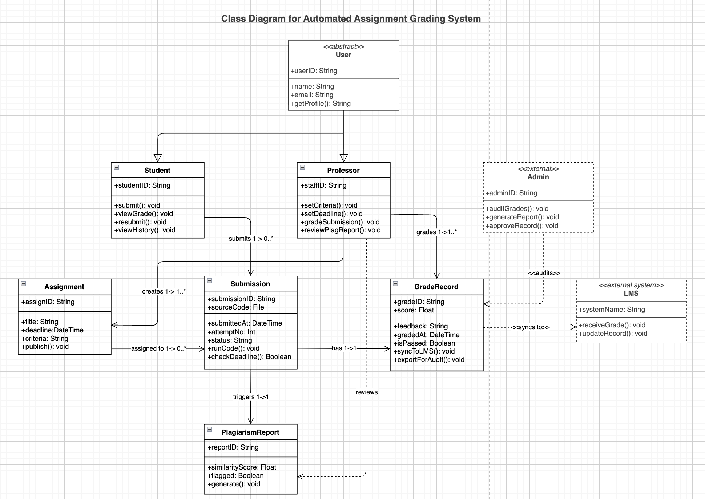
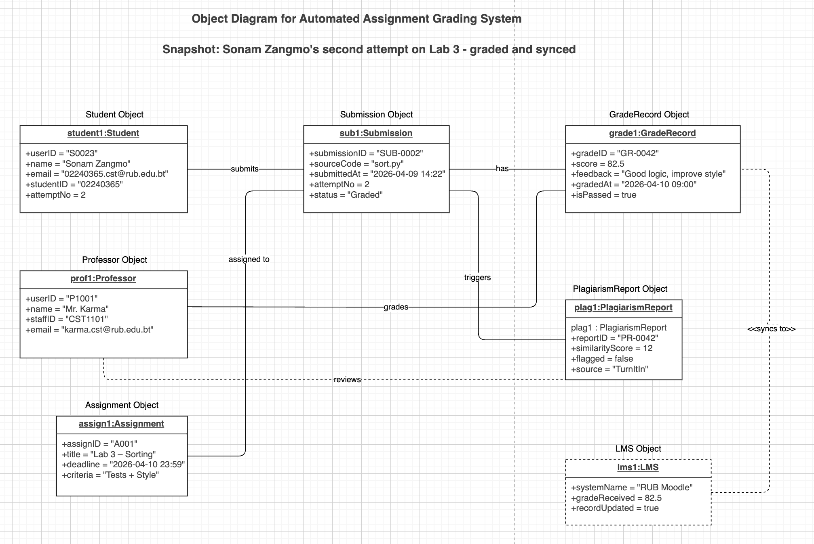

# Class Diagram and Object Diagram Report
## Automated Assignment Grading System
---

## Class Diagram

### What It Shows

A class diagram describes the **structure of the system** — what things exist in the system, what information they store, and how they relate to each other. Think of it as the blueprint before building the system.

### Classes Explained

- **User** - marked as `«abstract»` because no one logs in as just a "User". It holds common information (ID, name, email) that both Student and Professor share, so we do not repeat it.

- **Student** - inherits from User. Can submit code, view their grade, and resubmit if they fail.

- **Professor** - inherits from User. Sets the deadline and grading criteria, grades submissions, and reviews plagiarism reports.

- **Admin** - marked as `«external»` with a dashed border because Admin is a regulatory body outside the university system. Admin does not log into the grading system - they only access grade records for auditing. This is why Admin does NOT inherit from User, unlike the previous version.

- **LMS** - marked as `«external system»` with a dashed border because it is the university's existing mainframe system. The grading system pushes grades TO the LMS; the LMS itself is separate.

- **Assignment** - represents one programming task created by the Professor. Stores the title, deadline, and grading criteria.

- **Submission** - represents one attempt by a student. Stores the uploaded code file, submission time, attempt number, and status. This is the central class because everything revolves around a submission.

- **GradeRecord** - stores the score and feedback given by the Professor after reviewing the submission. Can sync to the LMS and export for audit.

- **PlagiarismReport** - automatically generated when a submission is made. Stores the similarity score from TurnItIn and whether the submission was flagged.

### Relationships 

| Relationship | What It Means |
|---|---|
| User → Student *(inheritance)* | Student is a type of User - gets userID, name, email automatically |
| User → Professor *(inheritance)* | Professor is a type of User - same reason |
| Professor creates Assignment | A professor makes one or more assignments (1 to 1..*) |
| Student submits Submission | A student can submit zero or many times (1 to 0..*) |
| Assignment assigned to Submission | Each submission belongs to one assignment |
| Submission has GradeRecord | Each submission produces exactly one grade record (1 to 1) |
| Submission triggers PlagiarismReport | Each submission automatically generates one report (1 to 1) |
| Professor grades GradeRecord | The professor assigns the grade - one professor grades many records |
| Professor reviews PlagiarismReport | The professor checks the plagiarism result before finalising a grade *(dashed - optional dependency)* |
| GradeRecord «syncs to» LMS | After grading, the grade is pushed to the university LMS *(dashed dependency)* |
| Admin «audits» GradeRecord | The regulatory body accesses grade records once a year *(dashed dependency)* |

---

## Object Diagram

### What It Shows

An object diagram is a **real snapshot** of the system at one moment in time. Where the class diagram shows structure, the object diagram shows actual data. It proves that the class design works with real values.

### The Scenario

Student **Sonam Zangmo** (02240365) is submitting her sorting algorithm for **Lab 3** for the second time. Her first attempt had issues. This time, her code passes. The system runs it, checks it for plagiarism through TurnItIn, and Professor **Mr. Karma** grades it at 82.5. The grade is then synced to the university's LMS (RUB Moodle).

### Objects in the Snapshot

| Object | Class | Key Values |
|---|---|---|
| `student1` | Student | Sonam Zangmo, 02240365, attempt 2 |
| `prof1` | Professor | Mr. Karma , CST1101 |
| `assign1` | Assignment | Lab 3 – Sorting, deadline 10 April 2026 |
| `sub1` | Submission | sort.py, submitted 9 April, status Graded |
| `grade1` | GradeRecord | Score 82.5, passed, feedback given |
| `plag1` | PlagiarismReport | 12% similarity, not flagged, source TurnItIn |
| `lms1` | LMS | RUB Moodle, grade received and updated |

### Links Between Objects

| Link | Meaning |
|---|---|
| student1 — submits — sub1 | Sonam Zangmo submitted this specific file |
| assign1 — assigned to — sub1 | This submission is for Lab 3 |
| prof1 — grades — grade1 | Mr. Karma assigned the 82.5 score |
| prof1 — reviews — plag1 | Mr. Karma checked the plagiarism report before grading |
| sub1 — has — grade1 | This submission's result is stored in grade1 |
| sub1 — triggers — plag1 | Submitting the code automatically ran TurnItIn |
| grade1 — «syncs to» — lms1 | The 82.5 grade was pushed to RUB Moodle |

---

## References

- GeeksforGeeks. (2024, February 26). System design: Unified Modeling Language (UML) class diagrams. https://www.geeksforgeeks.org/system-design/unified-modeling-language-uml-class-diagrams/

- GeeksforGeeks. (2024, March 1). System design: Unified Modeling Language (UML) object diagrams. https://www.geeksforgeeks.org/system-design/unified-modeling-language-uml-object-diagrams/